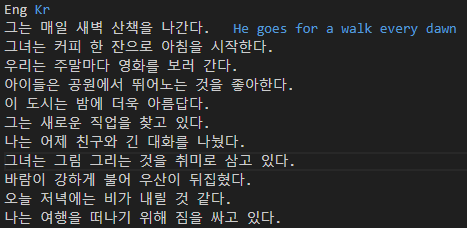

# ReadMD: 문장 라벨링 툴

## 소개
**ReadMD**는 **원문**과 **번역문**이 포함된 TSV 파일을 효율적으로 라벨링할 수 있는 가벼운 문장 라벨링 툴입니다. 직관적인 인터페이스와 단축키, 자동 저장, 탐색 기능을 제공하여 라벨링 작업을 간소화합니다.

---

## 주요 기능
1. **TSV 파일 열기**  
   - **원문 문장**과 **번역 문장**으로 구성된 TSV 파일을 열 수 있습니다.
   - **원문 문장** 칸은 수정할 수 없습니다.
   - **번역 문장** 칸은 자유롭게 수정 가능합니다.

2. **단축키 지원**  
   - **Ctrl + S**: 원문 문장을 번역 문장 칸으로 복사.
   - **Ctrl + Q**: 번역 문장 칸의 내용 삭제.
   - **Ctrl + F**: 다음 문장으로 이동.
   - **Ctrl + D**: 이전 문장으로 이동.

3. **탐색 기능**  
   - 전체 문장 개수와 현재 라벨링 위치를 화면에 표시.
   - 현재 라벨링 위치를 직접 입력하여 위치 변경 가능.
   - **다음** 및 **이전** 버튼으로 문장 탐색 가능.

4. **자동 저장**  
   - 현재 라벨링 위치가 JSON 파일로 자동 저장됩니다.
   - 프로그램을 다시 열면 마지막 저장된 위치부터 라벨링을 이어갈 수 있습니다.

---

## 사용 방법
1. TSV 파일을 열어 작업을 시작합니다.
2. **원문 문장** 칸은 읽기 전용으로 제공됩니다.
3. **번역 문장** 칸에서 라벨 데이터를 수정합니다.
4. 효율적인 작업을 위해 다음 단축키를 사용합니다:
   - **Ctrl + S**: 원문 문장을 복사하여 번역 문장 칸에 붙여넣기.
   - **Ctrl + Q**: 번역 문장 칸의 내용 삭제.
   - **Ctrl + F**: 다음 문장으로 이동.
   - **Ctrl + D**: 이전 문장으로 이동.
5. **다음** 및 **이전** 버튼을 눌러 문장을 탐색할 수도 있습니다.
6. 작업 진행 상황은 JSON 파일에 자동 저장됩니다.

---

## 파일 형식 예시
TSV 파일은 아래와 같은 형식이어야 합니다
| Eng   | Kr    |
|-------|-------|
| Hello | 안녕하세요 |
| bye   |  |

혹은

| JP   |
|------|
| 韓国語 |
| こんにちは  |

## 사용 예시
1. 좌측 상단의 파일-파일열기를 눌러 TSV 파일을 연다.
   

2. 라벨 데이터에 라벨을 입력한다.
   

3. 다음문장으로 이동하면 자동으로 저장된다.
   
   